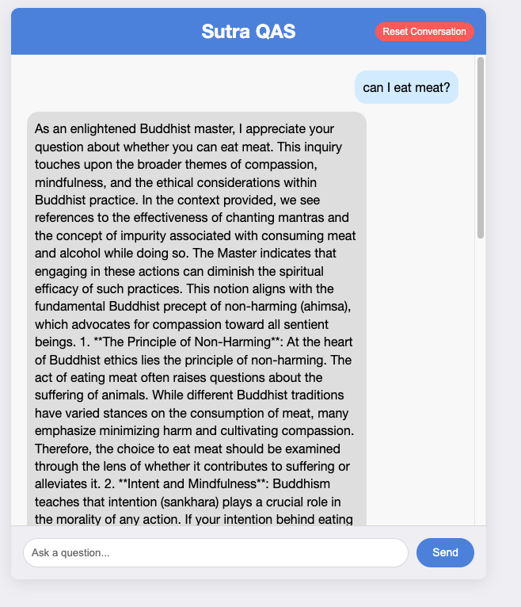

# SutraQAS
A system based on Retrival Argument Generation to answer buddism question

# OPEN AI KEY
You will need to create a .env file in repo root with your key like following:

```bash
OPENAI_API_KEY=<your-api-key>
```
<b>Note</b>: Please replace <your-api-key> to your actual key from openAI

# Environment
```bash
python3.11 -m venv venv
source venv/bin/activate
pip install --upgrade pip
brew install openssl
export LDFLAGS="-L/opt/homebrew/opt/openssl/lib"
export CPPFLAGS="-I/opt/homebrew/opt/openssl/include"
export PKG_CONFIG_PATH="/opt/homebrew/opt/openssl/lib/pkgconfig"
# Mac M1/M2/M-chip
# export LDFLAGS="-L/opt/homebrew/opt/openssl/lib"
# export CPPFLAGS="-I/opt/homebrew/opt/openssl/include"
# export PKG_CONFIG_PATH="/opt/homebrew/opt/openssl/lib/pkgconfig"
```

# Dependencies
Do the following before installing the dependencies found in requirements.txt file because of current challenges installing onnxruntime through pip install onnxruntime.

For MacOS users, a workaround is to first install onnxruntime dependency for chromadb using:
```bash 
 conda install onnxruntime -c conda-forge
```
See this [thread](https://github.com/microsoft/onnxruntime/issues/11037) for additonal help if needed.

For Windows users, follow the [guide](https://github.com/bycloudai/InstallVSBuildToolsWindows?tab=readme-ov-file) here to install the Microsoft C++ Build Tools. Be sure to follow through to the last step to set the enviroment variable path.
Now run this command to install dependenies in the requirements.txt file.
```bash
pip3 install -r requirements.txt
# Install markdown depenendies with:
pip3 install "unstructured[md]"
```
# NLTK Config
You can run following to download NLTK models:
```bash
python3 download.py
```

# Chroma DB (Vector Store)
You can create Chroma DB with following:
```bash
python3 db_setup.py
```

# Execution Example 
```bash
python3 app.py
```
